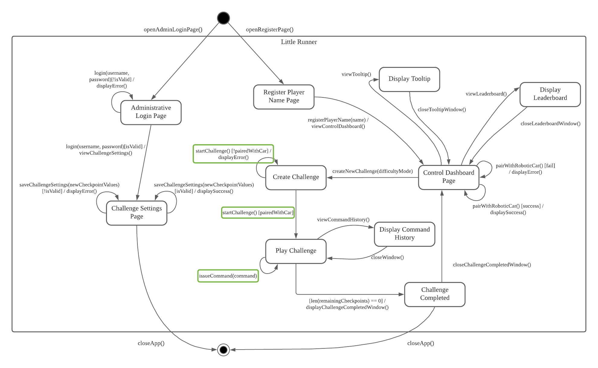

# ICT2101-p4-5
[](#)

### Team Members
- Ho Xiu Qi                   ```Team Lead``` - ```1802962@sit.singaporetech.edu.sg```
- Ng Kah Wei                  ```QA Engineer``` - ```2000994@sit.singaporetech.edu.sg```
- Lee Chee Kin Bernard        ```UI Designer``` - ```2002641@sit.singaporetech.edu.sg```
- Tan Hui Xuan, Coco Vanna    ```Business Analyst``` - ```2002262@sit.singaporetech.edu.sg```
- George Lee Wei Kang         ```Software Architect``` - ```2000700@sit.singaporetech.edu.sg```

---

## Project Pre-Requisites
- [Python 3.9.7](https://www.python.org/downloads/)

---

## Setup

### Cloning the Project Repo
1. Open a `shell` and navigate to desired directory to store project folder
2. Execute the command `git clone https://github.com/team-p4-5/ICT2101-p4-5.git`

### Installing dependancies
1. Navigate to root directory of project (where requirements.txt is)
2. Execute the command `pip install -r requirements.txt`

### How to run
1. Navigate to root directory of project (where run.py is)
2. Execute the command `python3 run.py`
3. Open any web browser and navigate to `localhost`

---

## Team P4-5's Workflow
## Rules
Any changes to the repository MUST be first done on a `ui/<feature_name>`, `backend/<feature_name>`, or `management/<feature_name>` branch, before merging it with `dev` branch, followed by `main` branch
### Issue Management
1. An issue **MUST** be created for each assigned feature
2. Issues for feature components are **ADVICED** to be created to help with tracking feature progress
3. Issue titles **MUST** start with `[<feature_type>/<feature_name>]`
4. Issues **MUST** be assigned to **at least ONE** team member
5. Issues **MUST** be given the appropriate label(s) (e.g. `ui` / `backend` / `management` / `hotfix`)
6. Issues **MUST** be assigned to the `M3` milestone
7. Issues **MUST NOT** be closed until corresponding feature is completed and merged with `dev` or `main` branch
### Feature Branch Management
1. Features **MUST** have a corresponding branch created for it
- `ui/<ui_feature_name>` for Web UI related features
- `backend/<backend_feature_name>` for backend code related features
- `management/<management_feature_name>` for project / repo management related features (e.g. README.md changes)
2. Pushes to feature branch should only be done after completing a **WORKING** version of the feature component / feature
### Development Branch Management
1. Only **COMPLETED** `ui`, `backend`, or `management` feature branches can be merged into the `dev` branch
2. Pull Requests (PR) to merge should be done through GitHub's web UI
3. Pull Requests should be created by assigning exactly 4 other team mates for review and approval
4. Final action to merge the feature branch with `dev` branch **MUST** be done by the PR initiater after receiving all 4 approvals
### Main Branch Management
1. Only `dev` branch can be merged into the `main` branch
2. Pull Requests (PR) to merge should be done through GitHub's web UI
3. Pull Requests should be created by the **_Team Lead_** and assigned to exactly 4 other team mates for review and approval
4. Final action to merge the feature branch with `dev` branch **MUST** be done by the **_Team Lead_** after receiving all 4 approvals

---

## Standard Operating Procedures (SOP)
### I. Starting an Assigned Feature
1. Create **HIGH-priority** issue on team's GitHub project board
2. Create corresponding type of feature branch based off current `dev` branch
```bash
# Creating a new `ui` feature
git checkout -b ui/<ui_feature_name> dev

# Creating a new `backend` feature
git checkout -b backend/<backend_feature_name> dev

# Creating a new `management` feature
git checkout -b management/<management_feature_name> dev
```
3. After making initial changes, create this new feature branch on GitHub repo
```bash
# Commit the newly created feature branch with a meaningful message
git commit -am "initial commit for <feature_type>/<feature_name> branch"

# Push the newly created feature branch onto GitHub repo
git push --set-upstream origin <feature_type>/<feature_name>
```
### II. Save Feature progress
1. Commit and push **WORKING** version of feature with newly added component (do this the moment a feature component is deemed completed)
```bash
# Commit changes with a meaningful commit message
git commit -am "[ADDED]|[REMOVED]|[MODIFIED] <feature>'s <feature_component> ..."

# Push changes into corresponding feature branch on GitHub repo
git push
```
### III. Merging a Completed Feature branch with Development branch
1. Go to `https://github.com/team-p4-5/ICT2101-p4-5/pulls` in a web browser
2. Click on the `New pull request` button
3. Select `dev` in the `base:___` dropdown list
4. Select corresponding feature branch in the `compare:___` dropdown list
5. Click on the `Create pull request` button
6. Input meaningful PR **_title_** and **_comment_**
7. Select 4 reviewers aside from yourself under `Reviewers` settings
8. Assign yourself under `Assignees` settings
9. Assign `Labels` according to the type of the feature involved in this PR
10. Assign the PR to the corresponding `ICT2101/2201 Team Project` project and `M3` milestone
11. Click on the `Create pull request` button
12. Once all 4 approvals have been given, click on the `Merge pull request` button on the newly created PR's page
13. Input meaningful merge **_title_** and **_message_**
14. Click on the `Confirm merge` button
15. Close the corresponding issue for the feature

### IV. Merging Development branch with Main branch
1. Go to `https://github.com/team-p4-5/ICT2101-p4-5/pulls` in a web browser
2. Click on the `New pull request` button
3. Select `main` in the `base:___` dropdown list
4. Select `dev` in the `compare:___` dropdown list
5. Click on the `Create pull request` button
6. Input meaningful PR **_title_** and **_comment_**
7. Select 4 reviewers aside from yourself (**_the Team Lead_**) under `Reviewers` settings
8. Assign yourself (**_the Team Lead_**) under `Assignees` settings
9. Assign the PR to the corresponding `ICT2101/2201 Team Project` project and `M3` milestone
10. Click on the `Create pull request` button
11. Once all 4 approvals have been given, click on the `Merge pull request` button on the newly created PR's page
12. Input meaningful merge **_title_** and **_message_**
13. Click on the `Confirm merge` button

### V. Making changes / hotfixes to a completed Feature (closed issue)
1. Create a **HIGH-priority** `[<feature_type>/<feature_name>] [HOTFIX]` issue on team's GitHub project board with the appropriate feature label and `hotfix` label
2. Upon completing the hotfix implementation, commit and push **WORKING** version of feature
```bash
# Commit changes with a meaningful commit message
git commit -am "[HOTFIX] <feature>'s <feature_component> ..."

# Push changes into corresponding feature branch on GitHub repo
git push
```
3. Perform procedure (III) for merging hotfixed feature branch into dev
4. Close the corresponding [HOTFIX] issue

### VI. Approving a Pull Request
1. Open the PR where you have been assigned as a Reviewer
2. Select the `Add your review` button
3. After reviewing the changes, select the `Review changes` button
4. Input a review **_comment_** in the popup window
5. Select the `Approve` radio button
6. Select the `Submit review` button

---
## User Acceptance Test (UAT)
### System State Diagram (Updated)
The following is the project's updated System State Diagram, where refinements made have been highlighted in green. For detailed information of the refinements made to the System State Diagram and System Test Cases, refer to the [UAT Manual](documentation/user_acceptance_testing/uat_user_manual.pdf).

### System Test (UAT) Environment Preparation
Before performing the System Tests (UAT), the following changes need to be made to swap the product code into "TEST" mode

1. Set `TESTING_MODE` constant to `True`

2. Uncomment `checkpoint_list = [1]` and `generateTestMap()`

3. Uncomment `depairWithCar()`


### System Test (UAT) Video
[](https://youtu.be/GbVLMYQULxk)

---
## Whitebox Testing
### Selected Class for WB Testing Showcase
The class that the team has decided to use for demonstrating Whitebox Testing code is the **`ChallengeManagement`** class.

**`ChallengeManagement`** is a Control class that depends on the **`Challenge`** Entity class for managing challenge instances, and uses the **`LeaderboardManagement`** Control class for saving records of completed challenges. These classes can all be  found in [Challenge.py](app/libraries/Challenge.py).

### Whitebox Test Cases
The following test cases can be found under [app/libraries/testsuite.py](app/libraries/testsuite.py).
| Test Case                             | Test Case Description                                                                                                                                                |
|---------------------------------------|----------------------------------------------------------------------------------------------------------------------------------------------------------------------|
| `test_challengeCreation_feature()`    | Function to test if Challenge objects can be instantiated properly                                                                                                   |
| `test_playerName_methods()`           | Function to test if 'playerName' attribute of a Challenge object can be successfully retrieved and modified                                                          |
| `test_difficultyMode_methods()`       | Function to test if 'difficultyMode' attribute of a Challenge object can be successfully retrieved                                                                   |
| `test_startChallenge_feature()`       | Function to test the 'start challenge' logic of a Challenge object                                                                                                   |
| `test_remainingCheckpoints_feature()` | Function to test retrieving of the 'remainingCheckpoints' list of a Challenge object                                                                                 |
| `test_removeCheckpoint_feature()`     | Function to test if the removal of checkpoints from a Challenge object's remainingCheckpoints list can be reliably rejected / accepted based on different conditions |
| `test_completeChallenge_feature()`    | Function to test challenge completion logic of a Challenge object                                                                                                    |
| `test_saveChallenge_feature()`        | Function to test if saving of a Challenge record in the database can be reliably allowed / rejected based on different conditions                                    |

### Code Coverage Statistics
**Statement Coverage** analysis is performed using the [`coverage`](https://coverage.readthedocs.io/en/6.2/) python library to ensure that the test cases from [app/libraries/testsuite.py](app/libraries/testsuite.py) adequately covers the testing of the **`ChallengeManagement`** class and dependancies. Code coverage statistical reports are also _automatically generated_ under `app/libraries/htmlcov/`


For the detailed statistics, please see [`app/libraries/htmlcov/Challenge_py.html`](app/libraries/htmlcov/Challenge_py.html)

### Whitebox Testing (Test Suite) Execution Instructions
```bash
# [1] Ensure you have installed python dependancies from 'requirements.txt' in the root project folder
pip3 install -r requirements.txt

# [2] Navigate to app/libraries
cd app/libraries

# [3] Run 'testsuite.py' in the directory to run unit tests
python3 testsuite.py
```

### Whitebox Testing (Code Coverage Analysis) Execution Instructions
```bash
# [1] Ensure you have installed python dependancies from 'requirements.txt' in the root project folder
pip3 install -r requirements.txt

# [2] Ensure you have 'coverage' installed (https://coverage.readthedocs.io/en/6.2/)
pip3 install coverage

# [3] Navigate to app/libraries
cd app/libraries

# [4] Run 'coverage' in the directory to run unit tests in 'testsuite.py'
coverage run -m unittest discover

# [5] Generate the HTML Code Coverage Statistics report
coverage html --omit="testsuite.py"

# [6] Go to the sub-directory 'htmlcov' and open 'index.html'

# [7] In the newly opened web browser page, navigate to 'Challenge.py' to view its detailed code coverage information
```
### Full Whitebox Test Suite Execution Video
[](https://youtu.be/OzhCye0v1v0)
___
